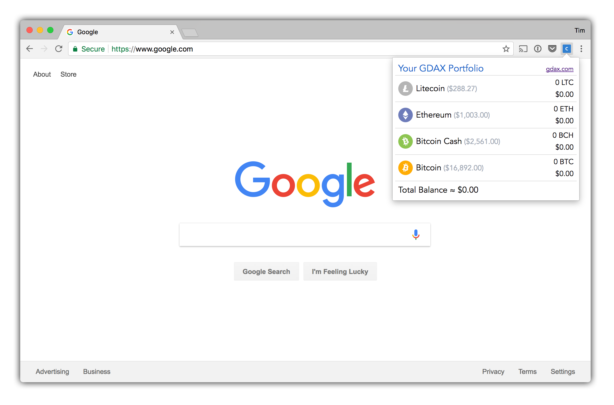
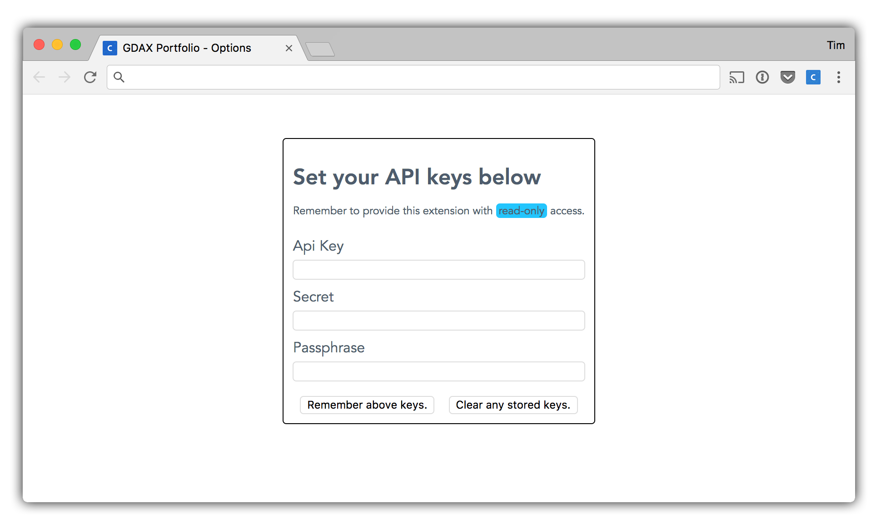

# GDAX Portfolio

A chrome extension for keeping track of your GDAX portfolio with the [Coinbase](https://www.coinbase.com) look-and-feel. [GDAX](https://www.gdax.com), which is meant to support advanced trading use cases does not offer a quick at a glance overview of your holdings. This extension makes an overview available to you at anytime in your browser.

## Installation

This extension is currently very experimental and can be installed as an unpacked local extension through the menu in `chrome://extensions/`.

## Options Page

Set your `read-only` API keys on the options page to give the extension access to your portfolio information. This extension is only is allowed to communicate with `https://api.gdax.com/`, but you should never provide this extension more than `read-only` access.

## FAQ

### "Can I make changes and improve this extension?"
\- Yes! Clone it, fork it, do whatever.